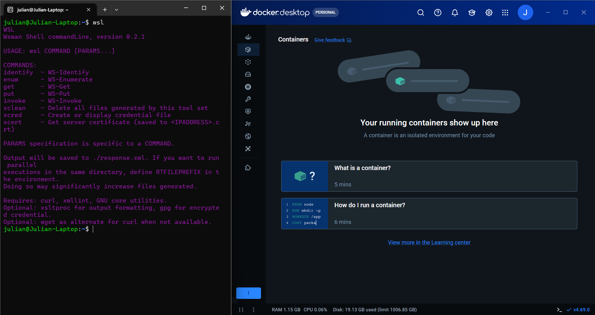
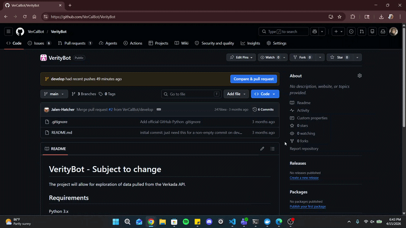
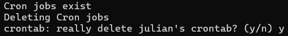
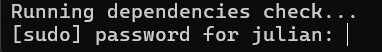
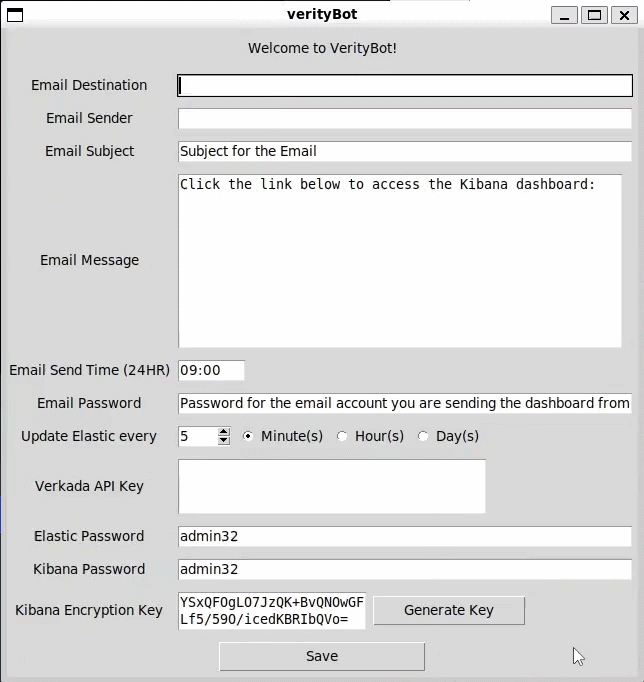
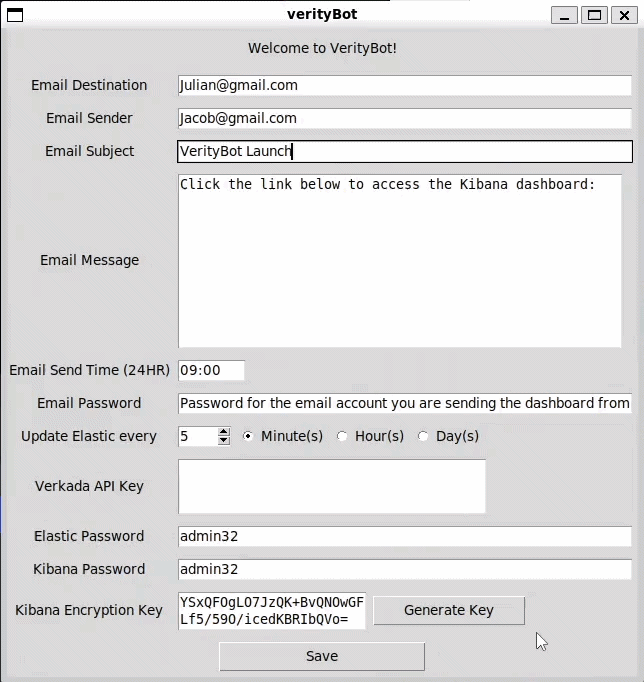
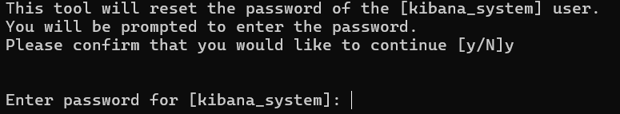
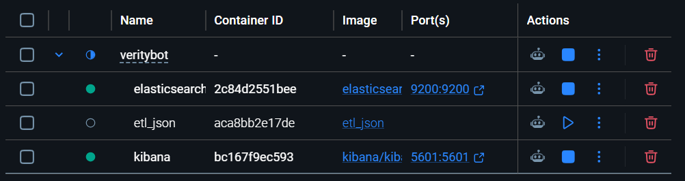
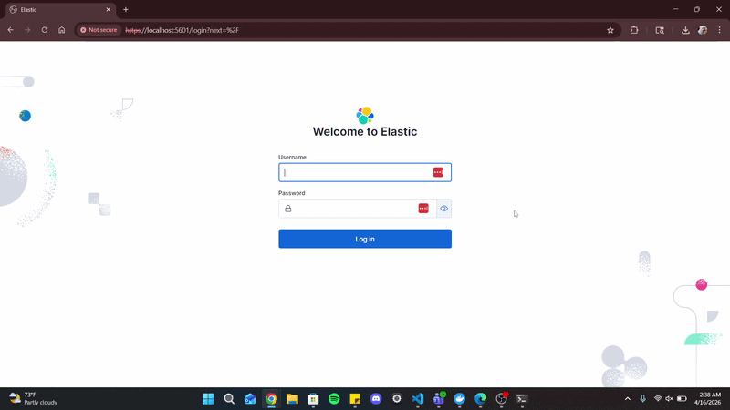
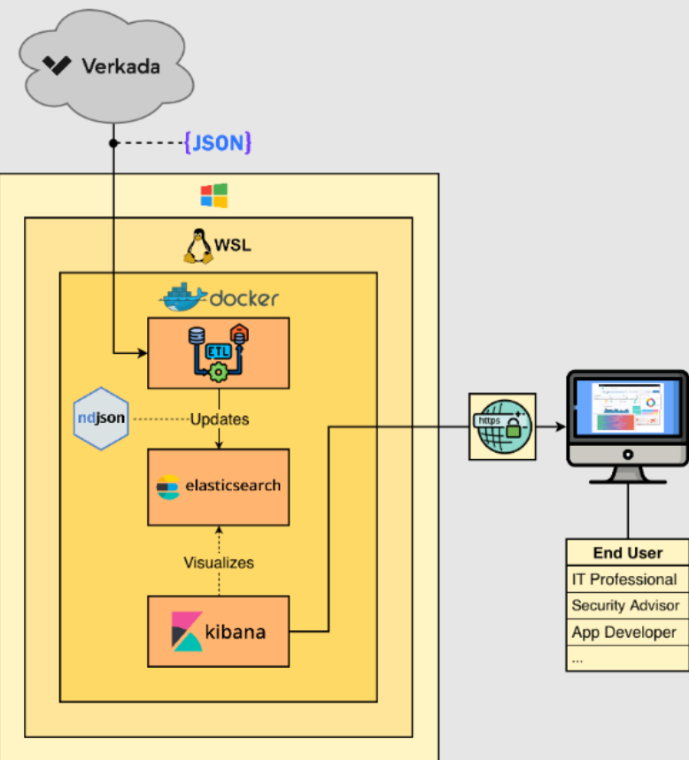

# **VerityBot**
VerityBot is a robust, software solution intended for users who want to make informed security decisions. Using digital sensor data from Verkada -- a premier physical security platform, our application provides detailed, analytical insights into your Verkada system. It is portable, reliable, data-driven, and allows users to feel confident in making important security decisions.

## Requirements
| Requirement                             | Installation                         |
| --------------------------------------- | ------------------------------------ |
| Docker Desktop                          | [Download Here](https://www.docker.com/products/docker-desktop/)     |
| WSL                                     | Prompted during Docker install       |


### <a name="install-and-build">Install & Build 🛠️</a>

Follow this [guide](https://docs.docker.com/desktop/features/wsl/) to set up Docker Desktop and WSL2


Clone the VerityBot git repository into the WSL2 terminal
```git clone git@github.com:VerCalBot/VerityBot.git```

### <a name="Initial Setup">Initial Setup 🧑‍💻</a>
Ensure that Docker Desktop is open and running on your host machine \


Search for WSL in Windows and open it


Navigate to ```VerityBot/scripts``` and run ```./initial_setup.sh``` \


If prompted, confirm you would like to delete existing Cron jobs \


When prompted, enter your User password \


Enter your credentials into the popup dialogue box
**Note**: All fields must be filled, use the ```Generate Key``` button to create a Kibana Encryption Key.
**Note**: All passwords must be at least 6 characters long. \


Click ```Save``` and exit the popup box \


When prompted, confirm you would like to continue and enter the password for ```kibana_system```. 
**Note**: This should be the same password as the one you placed in the popup for ```Kibana Password```. \


When you see *Setup Complete*, wait until the containers finish starting. 

Use ```docker compose ps``` or view Docker Desktop to check each containers status.
**Note**: The *etl_json* container will  \


Once containers are fully running, then open Kibana. \
```https://localhost:5601```

log in with the following:
Username: elastic
Password: The password you set in the popup box for ```Elastic Password``` \



### <a name="Troubleshooting">Troubleshooting 🚧</a>
Force quitting Docker Desktop and reopening it has been found to fix a variety of problems with VerityBot.

### <a name="Project Structure">Project Structure 🏗️</a>
