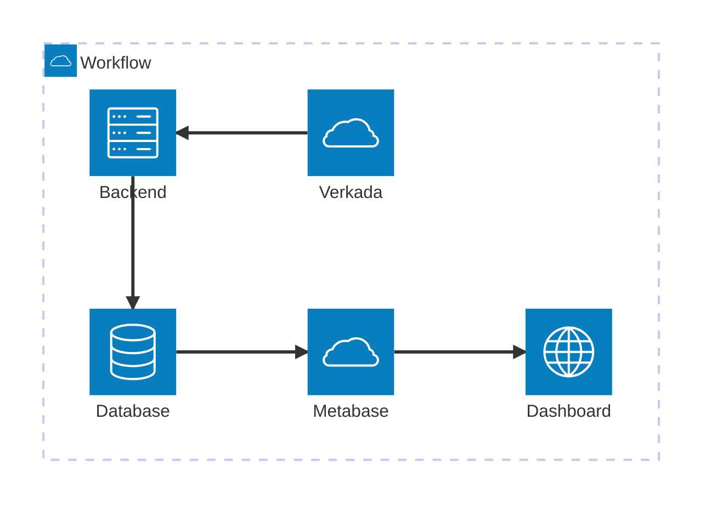

## Architecture
Note: Arrows indicate direction of data transfer

```mermaid
architecture-beta
    group wf(cloud)[Workflow]

    service vk(cloud)[Verkada] in wf
    service backend(server)[Backend] in wf
    service db(database)[Database] in wf
    service vz(cloud)[Metabase] in wf
    service dashboard(internet)[Dashboard] in wf


    %% arrows indicate
    %% direction of data transfer
    vk:L --> R:backend
    db:T <-- B:backend
    vz:L <-- R:db
    vz:R --> L:dashboard
```
